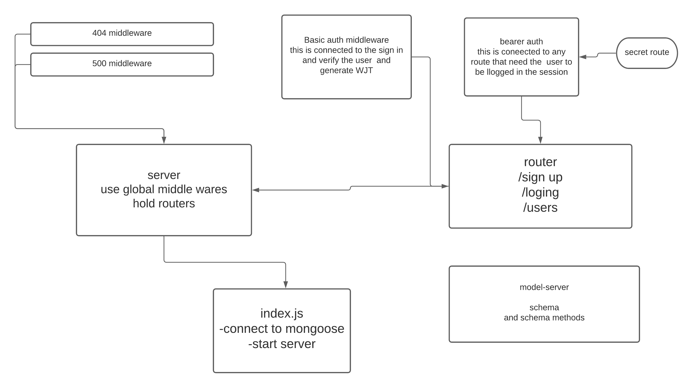

# auth-server

### Author: Waleed Farraj

This is a repo made to train on making sign in and sign up with basic authrization and session based token gernerated bearer authorization .
### Links and Resources

n/a

### Setup
* npm init -y
* npm install dotenv
* npm install mongoose
* npm i express
* npm i body-parser
* npm i cors
* npm i morgan
* npm i base-64
* npm i jsonwebtoken
* npm i bcrypt

#### How to initialize/run your application :

node index.js 
then test routes on postman.

#### Tests

/bad route 
/secrte route

#### UML
