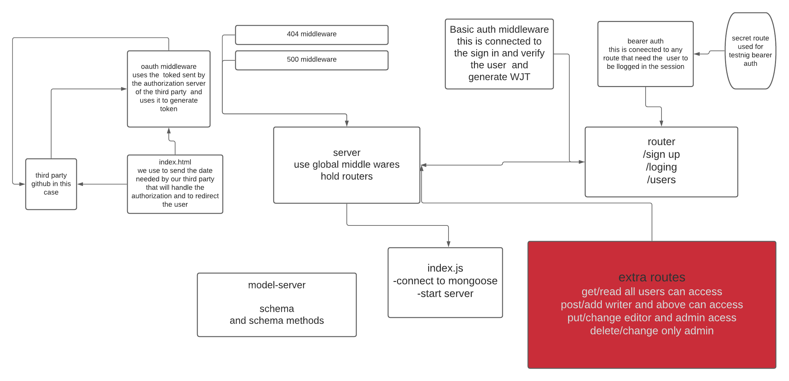

# auth-server

### Author: Waleed Farraj

This is a repo made to train on the conspets of making sign in and sign up with basic authrization and session based token gernerated bearer authorization it also include role based authintaction where a user is restricted from accessing routes only for personal.


### Setup
* npm init -y
* npm install dotenv
* npm install mongoose
* npm i express
* npm i body-parser
* npm i cors
* npm i morgan
* npm i base-64
* npm i jsonwebtoken
* npm i bcrypt


#### How to initialize/run your application :

node index.js 
then test routes on postman.

#### routes
```
post/signin
post/signup
get/users
get/read all users can access
post/add writer and above can access
put/change editor and admin acess
delete/change only admin
```
###### test routes
```
/bad route 
/secrte route
```

#### UML
